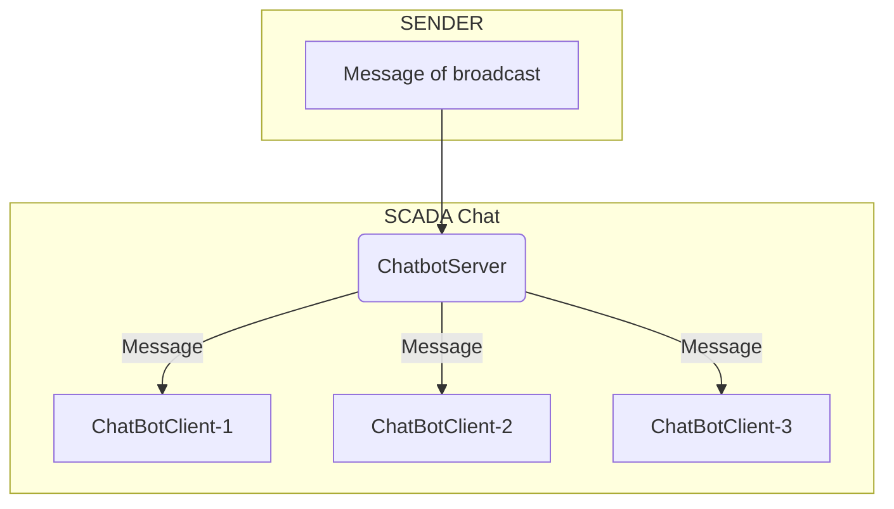

## scada
### RU

Демо чат-бот `chatbotserver` обменивается данными по tls с чат-клиентами `chatbotclient`.    

***Схема обмена данными (scheme exchange of data):***

Для проверки, запустить модуль `chatbotserver` и клиентские модули `chatbotclient`. 

### EN

Demo chatbot `chatbotserver` exchange  data via tls with chat-clients `chatbotclient`.   

To test, run the `chatbotserver` module and the `chatbotclient` client modules.

